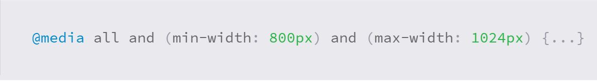

# What is RWD (Resopnsive Web design)?
### The goal of responsive web design is to make websites suit every device and every screen size.
- Mobile
- Desktop
## Why RWD?
### The main purpose of this is to ensure a satisfying experience for all users
#### This term was developed by **Ethan Marcotte**.

## Two terms with a slight difference
1. ***Responsive*** means: to quickly and positively react 
Websites change based on different factors like:
- Viewport width
2. ***Adaptive*** means: to be easily modified

## How do websites adapt to mobiles?
It requires building a seperate website on a different doamin

### What obstacle do they face?
Mobile websites denpend on new code base and browser sniffing
 
A *popular* solution is using favoring design which includes the three types **responsive, adaptive and mobile.**

## What is flexible grid?
it's the practice followed to obtain **Flexible layout** which has the ability to dynamically change the size relating to any width.

### To build flexible grid, use relative length units
- em
- percentage

### A new relative units introduced by CSS3 related to the viewport size of the browser:
        vw Viewports width
        hw Viewports height
        vmin 
        vmax 

Nevertheless, these units lack to adequate support  

## To convert fixed measurments units to relative units
By this formula, dividing the target width by it's parent element width
*for example:*
An element with **538px** width, contaings a child element with a **10px** margin. Using the flexible grid formula the margin will be:
10px ÷ 538px = .018587361 > 1.8587361%
#### This formula should be applied to all elements to get a completely dynamic website

## Using media query
You can use media querey in order to specify different styles for individual browser and device circumstances.

Using `@media` inside of an existing style sheet is the way to use media queries, improting the new style sheet using `@import` 

Or you can link to a seperate stylesheet in the HTML document.

### When a media feature takes effect?
The expression that follows the media type which is like (all, screen, print, tv, and braille) allocate either to true of false, it will take action if it allocates to true only.

### You can add extra conditions by using logical operators 
- and
- not 
- only

## What is mobile first?
It's a popular technique while using media queries. The styles used is targeted at smaller viewports as the default styles for a website.
### Why?
It's important for mobile users to quickly get to websites, so the loading shouldn't be the same for desktop. This means less waste of bandwidth

### What is viewport scale?
Its initial value, `initial-scale` should be positive integer between 1 and 10, it defines the ratio between device viewport height (if it's in portrait orientation), and its viewport size. Generally speaking, this value will most commonly be set to 1.

## The minimum-scale and the maximum-scale
These values determine if website zooming is enabled or disabled. Its values should be between 0 and 10. 
Also the `user-scalable` value (yes or no) defines if the user zooming is on or off. It's prefered to let users able to zoom in and out.

------------------------------------------------------------------------------

# What is float property?
### The float property is the way you wrap text around images. This is different from telling the text to go out of the page flow when using **position absolute** property. So floated elements stay part of the *page flow*.

## How to set float property?
`#img {
  float: right;
}`
### Values for float property:
- right
- left
- none (the default)
- inherit (follows the element parent element float value)

### Float is used to create the entire web layouts
## A stronger tools than float are:
1. Flexbox
2. Grid

### Take for example this photo, whenever it changes size the text will reflow so the result is the same as before:
 

### What is `clear` property?
It's the sister of `float` property, and what it does is letting elements to work not as float desires.

### **Clear*** has four values:
- Both 
- Left
- Right
- None (the default)
#### And the fifth is 
- Inherit 
