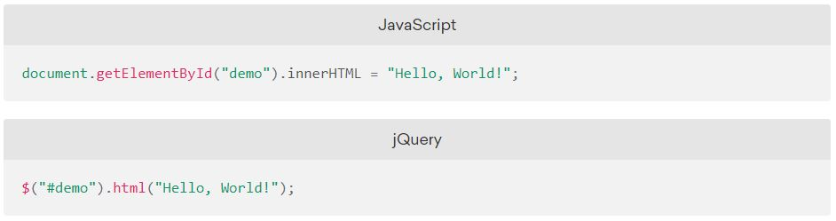

# Why to use jQuery?
## - It makes coding simpler
## - You can select elements accurately.
## - You can update these elements as well.

# What is it?

### It's a javaScript file that you should include in your web pages.
### It's used for selecting CSS-style selectors.
Usuallay, it's placed before the closing body tag. 
#### A function called jQuery
Another javaScript file should be included in order to use jQuery methods and selectors.
A shortcut for using it:
`$()`
INSTED OF;
`$jQuery()`

The above combination is called jQuery selection, the other part is called **Method**. And each method has parameter(s) that conveys how to update the elements.
 
### It provides simpler way for:
- Selecting elements
- Loop through elements
- Add or remove elements
- Handle events

## In a nutshell 
#### jQuery *allows* you to **write less** but **do more** by writing less lines than needed in a plain JavaScript file.

### Animating objects is available using jQuery **as long you're dealing with CSS properties that have a number values

-------------------------
# Programming can take a way where two people are working together to solve the same problem
### We call them:
- Driver: who doesn't touch the code.
- And a navigator: this one who writes the code and listen to the driver instructions.
# Why is *pair programming* better than *solo programming*?
- Pair programming produces higher-quality code, although it takes longer time than in solor working.
- Pair programming improve coders' language and problem solving skills. 

### It is a great way to share how you approach problems!

